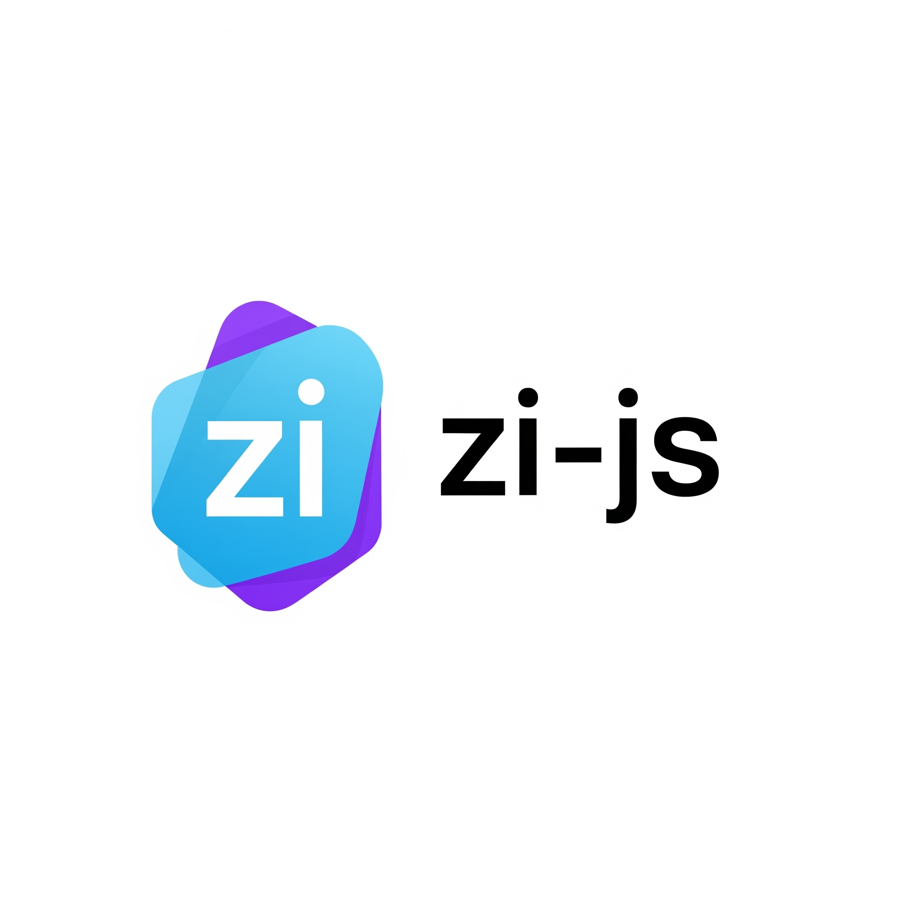

# Zi-js

好的，非常棒的构思！`zi-js` 这样一个专注于 AI 应用 UI 设计的 React 库，正好填补了当前前端开发在 LLM/Agent-based 应用领域的空白。下面我来详细介绍一下 `zi-js` 的设计理念、核心特性、主要组件、技术栈选择以及它如何帮助开发者。

---

## **zi-js：面向 AI 应用的 React UI 库**

### **项目愿景与定位**

`zi-js` 旨在成为前端开发者快速构建基于大语言模型（LLM）或智能体（Agent）应用的 UI/UX 利器。通过沉淀 AI 项目中常见的界面模式和组件，`zi-js` 将提供一套开箱即用、高度可定制的 React 组件，帮助开发者将重心放在 AI 逻辑本身，而非繁琐的界面实现。

**核心目标：**

1.  **快速启动 (Rapid Prototyping)**：提供一套简洁、高效的组件，让开发者在几分钟内搭建起 AI 应用的基础框架。
2.  **AI 友好 (AI-Native Design)**：组件设计考虑 LLM/Agent 交互的特性，例如流式输出、工具调用展示、思维链可视化等。
3.  **专注于体验 (User Experience Focus)**：参考大量现有 AI 项目的优秀 UI/UX 实践，确保组件的可用性和美观性。
4.  **轻量与独立 (Lightweight & Self-contained)**：尽量减少外部依赖，提供核心功能，保持库的简洁和高性能。

### **核心设计理念**

* **组件化 (Component-driven)**：将复杂的 AI 交互拆解为可复用、可组合的独立组件。
* **声明式 (Declarative)**：遵循 React 的声明式范式，通过 props 简单配置组件行为和外观。
* **可扩展 (Extensible)**：提供明确的插槽（slots）和定制点，允许开发者根据特定需求进行样式和行为的深度定制。
* **开箱即用 (Out-of-the-box)**：提供默认样式和行为，减少初始配置成本。
* **语义化 (Semantic HTML)**：生成语义化的 HTML 结构，有利于可访问性和 SEO。

### **技术栈选择**

* **核心框架**: `React`
    * 原因：目前前端生态中最主流、最活跃的框架之一，拥有庞大的社区支持、丰富的工具链和成熟的组件化实践。
* **CSS 框架/样式方案**: `Bulma`
    * 原因：
        * **纯 CSS**: Bulma 是一个纯 CSS 框架，不包含 JavaScript 组件，这与“尽量避免借助外部”的理念相符，开发者可以完全掌控组件行为。
        * **模块化**: 其模块化的结构允许开发者只引入需要的组件样式，保持打包体积小。
        * **响应式**: 内置优秀的响应式设计，方便构建适配不同设备的界面。
        * **易用性**: 基于 Flexbox，类名直观，学习曲线平缓。
    * **避免外部 JS 库**: 严格遵守这个原则，这意味着所有交互逻辑都将用 React 自身的状态管理和生命周期实现，而不是依赖 jQuery 或其他大型 UI 库。

### **核心组件类别及设想**

`zi-js` 将围绕 LLM/Agent 应用的典型交互流程，提供以下核心组件类别：

#### **1. 对话/聊天界面 (Chat/Conversation UI)**

* **`ChatContainer`**: 整个聊天界面的容器，提供布局和滚动管理。
* **`MessageBubble`**: 单条消息的气泡组件，支持用户消息、AI 消息（包括文本、富文本、Markdown渲染）。
    * **特性**: 支持头像、角色（User/Assistant/Tool）、时间戳、消息状态（发送中、已发送、失败）。
* **`InputArea`**: 聊天输入框，支持多行文本输入、发送按钮、快捷操作（如上传文件、清空）。
* **`StreamingText`**: 专门用于 LLM 流式输出的文本渲染组件，支持字符或词语逐渐显示的效果。
    * **特性**: 可配置的打字机速度、暂停/继续按钮、文本差异化高亮。

#### **2. AI 思考/工具调用可视化 (AI Thinking/Tool Call Visualization)**

* **`ThoughtProcessDisplay`**: 可视化 Agent 思考过程的组件，例如“思考中...”、“调用工具：xxx”、“观察结果：xxx”。
    * **特性**: 步骤式展示、可展开/折叠详情、代码块高亮。
* **`ToolCallCard`**: 展示 AI 调用特定工具的组件，显示工具名称、参数、执行状态。
    * **特性**: 参数高亮、成功/失败状态指示、可查看原始工具输出。
* **`ActionPanel`**: Agent 根据用户意图或思考结果，建议用户进行下一步操作的面板。
    * **特性**: 按钮组、卡片列表、可执行的操作（如“重新提问”、“编辑指令”）。

#### **3. 数据/结果展示 (Data/Result Display)**

* **`CodeBlock`**: 专门用于展示代码的组件，支持语法高亮。
* **`JsonViewer`**: 美观地展示 JSON 数据的组件，支持折叠/展开、搜索。
* **`DataTable`**: 展示结构化数据，用于表格形式的 AI 输出。
* **`ImageDisplay`**: 用于展示 AI 生成或处理的图像。

#### **4. 功能性/控制组件 (Functional/Control Components)**

* **`PromptEditor`**: 带有高级功能的提示词编辑器，支持变量注入、历史记录、模板管理。
* **`FileUpload`**: 用于上传文件，并显示上传进度和状态。
* **`SettingsPanel`**: AI 应用的通用设置面板，例如模型选择、API Key 配置等。
* **`FeedbackButton`**: 用户对 AI 响应进行反馈的组件（点赞/点踩）。

#### **5. 骨架屏/加载状态 (Skeleton/Loading States)**

* **`ChatSkeleton`**: 聊天消息的骨架屏，模拟 AI 响应中的等待状态。
* **`LoadingSpinner`**: 通用加载指示器。

### **开发考量**

* **文档完善**: 提供清晰、易懂的文档，包含每个组件的用法、Props、示例代码和最佳实践。
* **TypeScript 支持**: 提供完整的 TypeScript 定义文件，增强开发体验和代码健壮性。
* **国际化 (i18n)**: 考虑组件内部文本的国际化支持。
* **可访问性 (Accessibility)**: 确保组件符合 WAI-ARIA 规范，提供良好的无障碍体验。
* **性能优化**: 关注组件的渲染性能，避免不必要的重渲染。
* **主题化 (Theming)**: 考虑提供简单的机制来定制颜色、字体等主题变量，虽然基于 Bulma，但仍可提供变量覆盖的能力。
